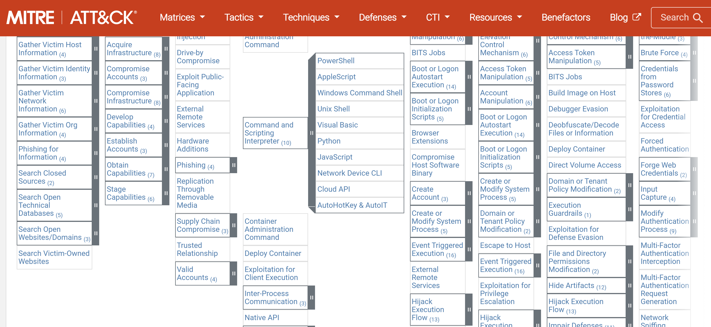
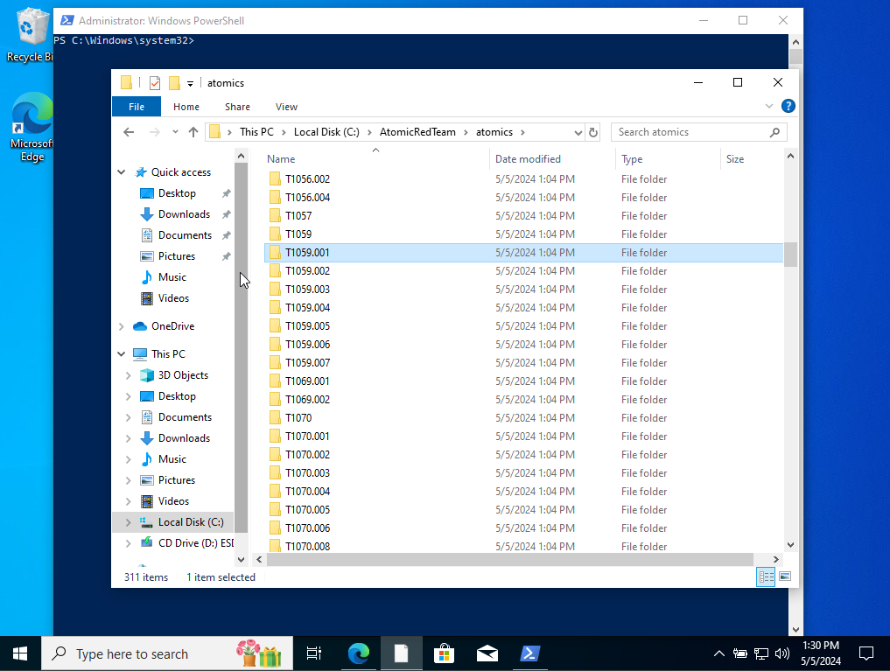
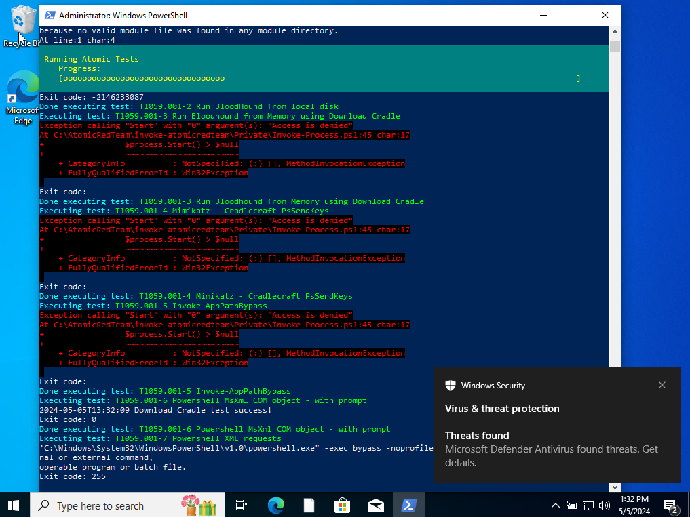
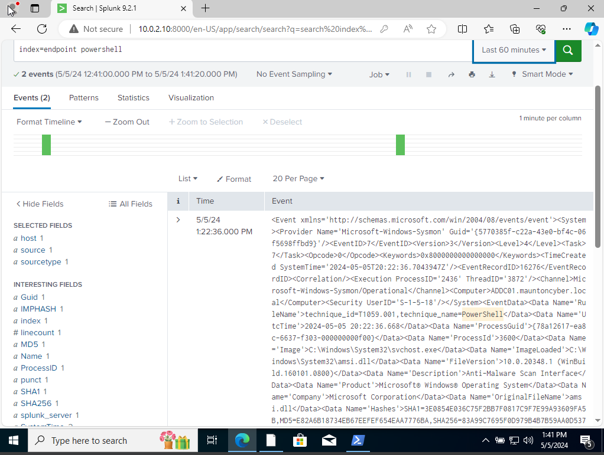

# Active Directory Detection Validation with Splunk and Atomic Red Team


## Table of Contents

- [Overview](#overview)
- [Why This Project Matters](#why-this-project-matters)
- [Lab Environment](#lab-environment)
- [Lab Architecture](#lab-architecture)
- [Detection Focus](#detection-focus)
- [Detection Outcome](#detection-outcome)
- [Project Workflow](#project-workflow)
- [Skills Demonstrated](#skills-demonstrated)
- [Sample Splunk Searches](#sample-splunk-searches)
- [Project Walkthrough](#project-walkthrough)
- [Key Takeaways](#key-takeaways)
- [Future Improvements](#future-improvements)
- [About This Repository](#about-this-repository)

## Overview

This project demonstrates a detection engineering homelab where **Atomic Red Team** was used to emulate adversary behavior and generate **PowerShell-related telemetry** in a Windows-based Active Directory environment. The resulting activity was analyzed in **Splunk** to validate visibility and strengthen detection-focused investigation skills.

Instead of only describing tool usage, this project highlights the workflow of:

- building a multi-system lab
- emulating attacker behavior with Atomic Red Team
- mapping activity to **MITRE ATT&CK**
- reviewing the resulting telemetry in **Splunk**
- validating that the lab can surface meaningful security events

## Why This Project Matters

This lab demonstrates skills relevant to blue team, SOC, and detection engineering roles:

- adversary emulation in a controlled lab
- MITRE ATT&CK technique mapping
- PowerShell activity generation and review
- SIEM analysis in Splunk
- Windows and Active Directory lab familiarity
- security documentation and technical reporting

## Lab Environment
### Tools

- Splunk
- Atomic Red Team
- MITRE ATT&CK
- PowerShell

### Systems

- VirtualBox
- Windows 10
- Windows Server 2022
- Ubuntu Server 22.04
- Kali Linux

## Lab Architecture

| Component | Role |
|---|---|
| Windows Server 2022 | Active Directory environment |
| Windows 10 | Target endpoint for telemetry generation |
| Splunk | SIEM for log ingestion, search, and analysis |
| Atomic Red Team | Adversary emulation framework |
| Kali Linux | Supporting attacker / testing system |
| Ubuntu Server 22.04 | Supporting lab infrastructure |
| VirtualBox | Virtualized lab environment |

## Detection Focus

This project focused on using **Atomic Red Team** to invoke a PowerShell-based test aligned to:

- **MITRE ATT&CK T1059.001 – PowerShell**

The objective was to generate realistic telemetry in the lab and verify that the activity could be identified in Splunk.

## Project Workflow

1. Build a multi-VM lab with Windows and supporting infrastructure
2. Review relevant MITRE ATT&CK techniques
3. Use Atomic Red Team to execute a PowerShell-based test
4. Generate security-relevant activity on the target host
5. Review resulting events and telemetry in Splunk
6. Document the findings and detection value of the test

## Detection Outcome

The Atomic Red Team PowerShell test successfully generated telemetry that could be reviewed in Splunk. This validated that the lab was capable of surfacing PowerShell-related activity associated with ATT&CK technique **T1059.001**.

This exercise helped confirm:

- PowerShell execution activity was visible in the SIEM
- the test generated useful security telemetry for investigation
- ATT&CK-aligned adversary simulation can be used to validate detections in a controlled environment
- the lab can be extended for additional detection engineering exercises

## Skills Demonstrated

| Area | Demonstrated Skill |
|---|---|
| SIEM Analysis | Investigated PowerShell-related telemetry in Splunk |
| Detection Engineering | Validated visibility from simulated adversary behavior |
| Adversary Emulation | Executed Atomic Red Team test cases in a controlled lab |
| Threat Mapping | Connected test activity to MITRE ATT&CK T1059.001 |
| Windows Security | Worked with PowerShell-generated security activity |
| Lab Engineering | Built and tested a multi-machine virtualized environment |

## Sample Splunk Searches

Below are example searches used to review PowerShell-related activity generated during testing.

```spl
index=* powershell
index=* EventCode=4104
index=* ("powershell.exe" OR "pwsh.exe")
```

## Project Walkthrough

### Network Diagram


This network diagram shows the overall homelab architecture used for the project. It illustrates how the Windows systems, Splunk instance, and supporting lab machines were arranged to generate, collect, and analyze security telemetry in a controlled Active Directory environment.

### MITRE ATT&CK Technique Reference



This screenshot highlights the MITRE ATT&CK technique used to guide the test scenario. In this project, the ATT&CK framework was used to map the simulated activity to **T1059.001 – PowerShell**, helping align the lab exercise with real-world adversary behavior and detection validation practices.

### Atomic Red Team Setup / Technique Review



This screenshot shows the Atomic Red Team technique information and test preparation stage. At this point in the workflow, the relevant PowerShell-based atomic test was reviewed to understand what activity would be generated on the target system and what telemetry should be expected in Splunk.

### Invoking Atomic Test T1059.001



This screenshot captures the execution of the Atomic Red Team test for **T1059.001 – PowerShell**. The test was run to emulate adversary-like PowerShell activity on the target host and intentionally generate logs that could later be reviewed in Splunk for visibility and detection validation.

### Splunk Detection View



This screenshot shows the resulting PowerShell-related telemetry observed in Splunk after the Atomic Red Team test was executed. The goal of this step was to confirm that the simulated activity was visible in the SIEM, review how it appeared in the logs, and validate that the lab environment was producing useful data for detection-focused analysis.

## Key Takeaways

- Atomic Red Team is effective for generating realistic test activity in a homelab
- MITRE ATT&CK mapping helps tie lab exercises to real-world adversary behaviors
- Splunk can be used to validate whether important PowerShell activity is visible and reviewable
- Detection-focused labs are a strong way to build blue-team and SOC-ready experience

## Future Improvements

- Add Splunk search queries or detection logic used during analysis
- Expand testing to additional ATT&CK techniques
- Include Sysmon or Windows event logging enhancements
- Document false positives and tuning opportunities
- Add a dedicated detection engineering notes section

## About This Repository

This repository is part of my cybersecurity homelab portfolio focused on detection engineering, SIEM analysis, adversary emulation, and defensive validation in Windows-based environments.

It reflects hands-on practice with:

- Splunk
- Atomic Red Team
- MITRE ATT&CK
- Active Directory lab testing
- PowerShell telemetry analysis
- detection validation workflows
